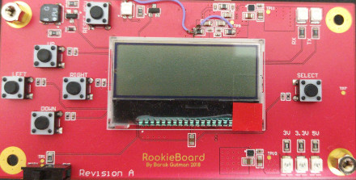
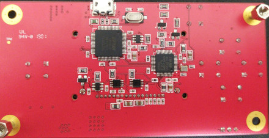

.. _rookieboard:

RookieBoard
#################

Overview
********

RookieBoard board is based on the ST Microelectronics STM32L071C8 Cortex M0+ CPU.


     


     RookieBoard

Hardware
********

RookieBoard provides the following hardware components:

- STM32L071C8 in LQFP-48 package
- ARM 32-bit Cortex-M0+ CPU
- 32 MHz max CPU frequency
- 3.3V work voltage
- 64 KB Flash
- 20 KB SRAM
- 3 KB EEPROM
- On peripherials:

    TBD

Supported Features
==================

TBD


Connections and IOs
===================

TBD

System Clock
============

TBD

Serial Port
===========

On RookieBoard, Zephyr console output is assigned to USART1.
Default settings are 115200 8N1.

I2C
---

TBD

Building and Flashing
*************************


Building
========

Building is done with CMake build system generator.

type in project's root directory the following:

```sh
cmake -B build -GNinja
```

and then:

```sh
ninja -C build
```

Flash the file *zephyr.bin* in *build/zephyr*. 

Flashing
========

Flashing is done via the *SWD* interface with *FT2232H* IC on board using *OpenOCD*.

Use *OpenOCD build 0.10.0+dev-00689-g6c2020eb-dirty* or higher.
To build and install OpenOCD follow OpenOCD's README file.

In './configure' stage make sure to use the flag '--enable-ftdi'.

for flashing, open terminal and type in project's root directory:
```sh
openocd -f boards/arm/rookieboard/support/openocd.cfg -f boards/arm/rookieboard/support/rookieboard_utils.cfg -c "rookieboard_flash build/zephyr/zephyr.bin"
```

Debugging
=========

For debugging follow the text in 'Flashing' but instead run the following command in terminal:
```sh
openocd -f boards/arm/rookieboard/support/openocd.cfg
```

In other terminal window open telnet by:
```sh
telnet localhost 4444
```

Links
**********
- RookieBoard Schematic:
   https://github.com/barakgut/rookieboard-hw/blob/master/rookieboard_schematic.PDF

TBD